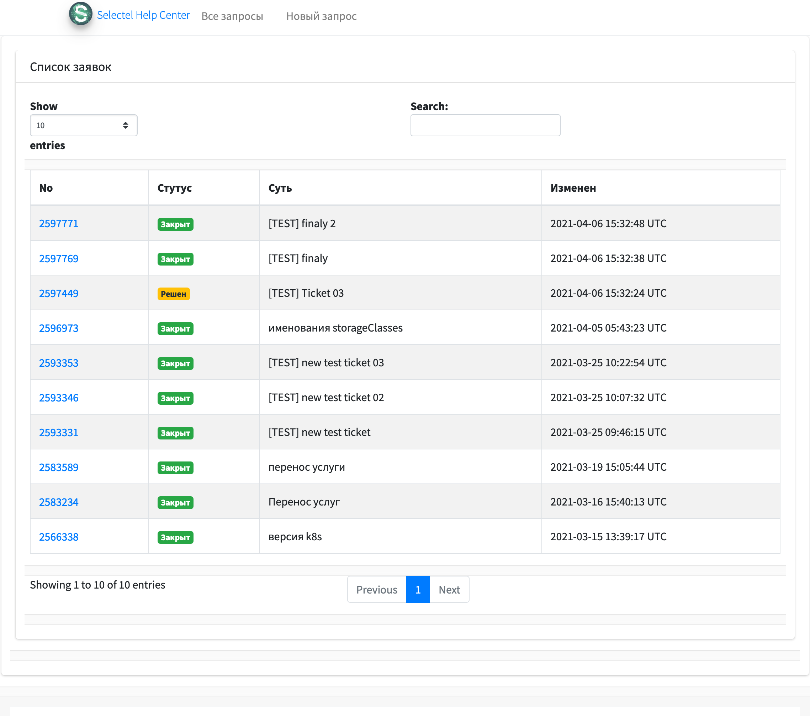
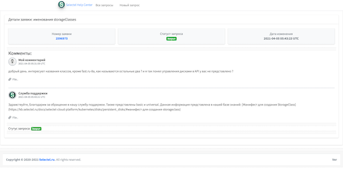
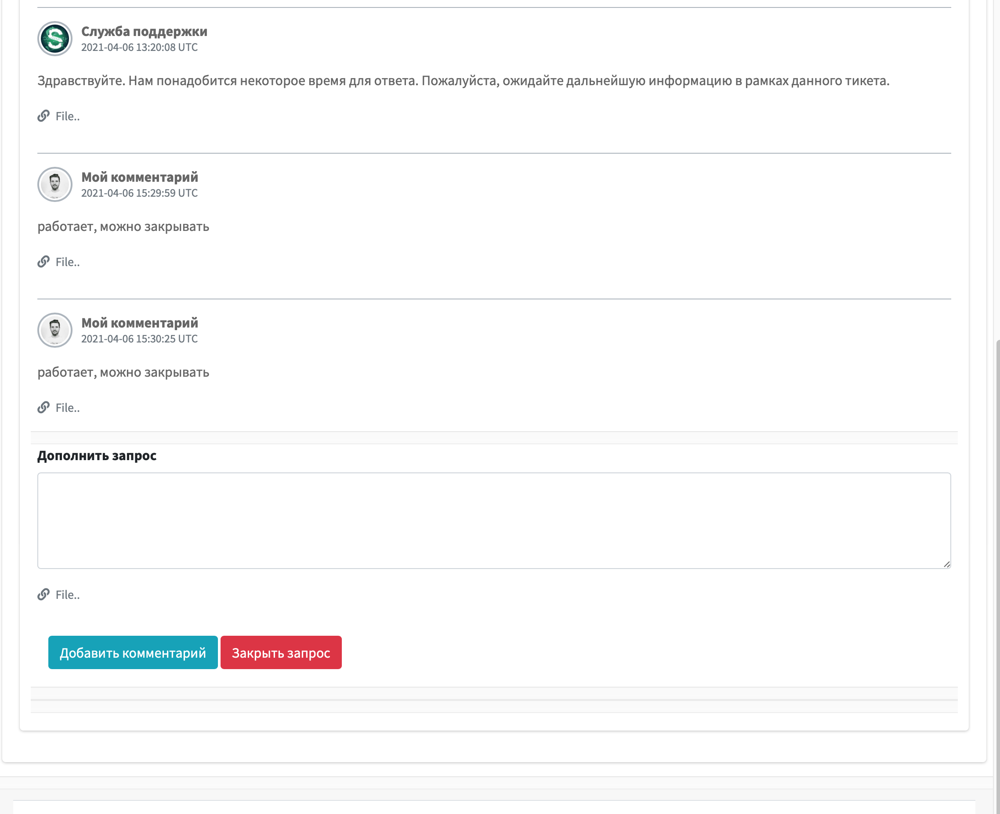

# Управление запросами в Selectel

- приложение полезно тем, у кого нет прямого доступа в ЛК Selectel, а есть только [токен](https://my.selectel.ru/profile/apikeys)
- позволяет получать доступ к службе поддержки, создавать и управлять запросами

Стартовая

Создание запроса

Просмотр запроса

Просмотр запроса

## Запуск

- для начала надо запросить токен у овнера (который имеет полный доступ в [кабинет](https://my.selectel.ru/profile/apikeys))
- `cp .env.example .env`
- заполняем `.env` токеном, если вдруг изменился поинт у API selectel - меняем его на правильный, смотреть [тут](https://developers.selectel.ru/docs/control-panel/tickets/)
- а так же прописываем мыло, на которое будут приходить уведомления об изменениях в заявках
- стартуем `./docker-start.sh`
- идем на [http://localhost:8080](http://localhost:8080) (порт также можно изменить в `.env`)
- что бы завершить работу - запускаем `docker-stop.sh` - контейнер будет удален

### Крутилки

- `docker-start-dev.sh` запускает отдельный докер-файл (`docker-compose-dev.yml`) для режима разработки (в этом случае папка `app/` монтируеются в контейнер на прямую)
- в `.env` указан мой регистри hub.docker.com (естественно вы можете форкнуть приложение, доработать его и собрать через `docker-builder.sh` себе в собственный регистри, предварительно поменяв переменную `DOCKER_REGISTRY` на свой адрес регистри)

### Важно

- т.к. приложение использует токен c полными правами и никак не защищено с точки зрения доступа посторонних, если вы запускаете его в локальной сети, необходимо самим позаботится о BasicAuth и каком-нибудь проксирующем nginx перед приложением
- и важно понимать, что токен дает право не только на работу с запросами в Службу поддержки, но и управление всей инфрой в ЛК.
- если токен попадет в плохие руки - советую обновить резюме на hh и искать другую работу

### TODO

- пока не реализована поддержка вложений файлов

### Автор \ Author

- **Vassiliy Yegorov** [vasyakrg](https://github.com/vasyakrg)
- [youtube](https://youtube.com/realmanual)
- [site](https://vk.com/realmanual)
- [telegram](https://t.me/realmanual)
- [any qiestions for my](https://t.me/realmanual_group)
